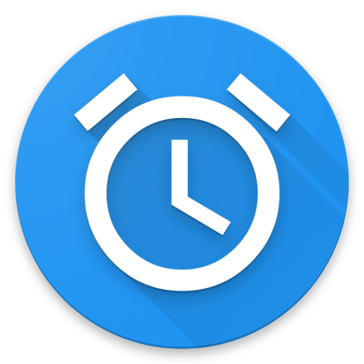

# Cloud Alarm
This application enables you to set alarm clocks through your browser.
To achieve this, this app creates a personal link that may be opened on
another device, such as your PC or Mac.

If your mobile phone is out of reach, just use your computer!

  

## Setup

Just download the app [from the Google Play Store](https://play.google.com/store/apps/details?id=net.kollnig.alarm).

## Background
This project was created back in 2016 to ease my studies at university.

Since this application may be helpful for others, I published it on Google Play,
alongside its source code.

If this app should change your life as well, leave a message.
